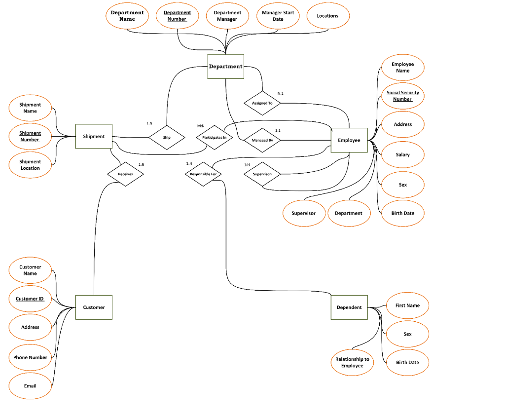
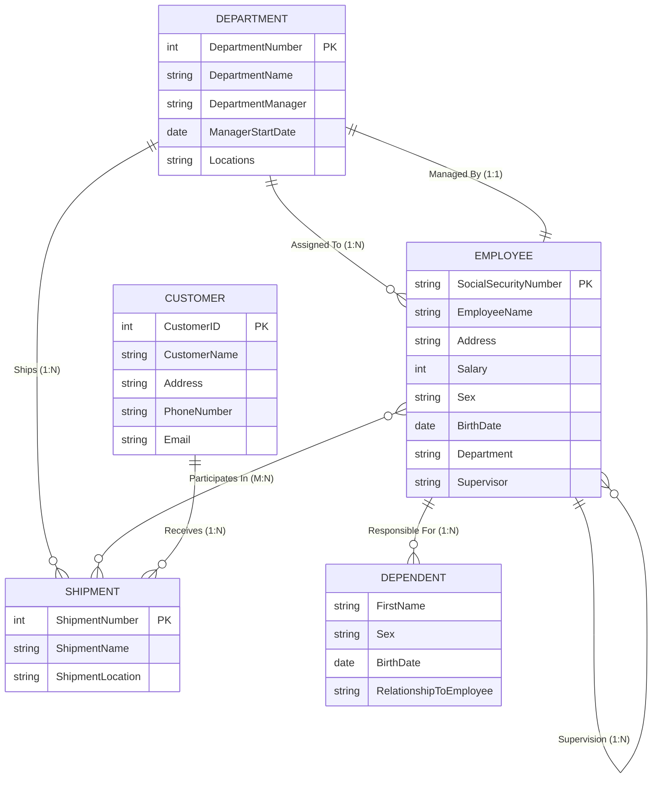
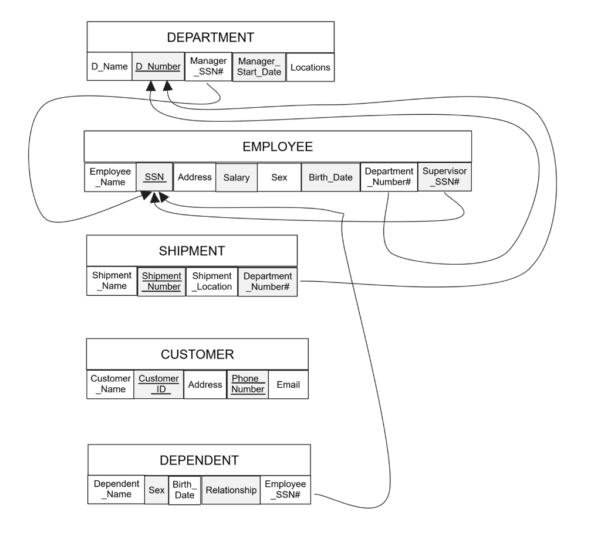

# Shipping Company Database System

A comprehensive Relational Database Management System (RDBMS) designed and implemented for a Shipment Company. This project covers the full database lifecycle, including requirements collection and analysis, conceptual modeling (E-R Diagram), logical schema design (relational mapping), and physical implementation with SQL DDL, DML, and query verification.

---

## Table of Contents
- [Project Overview](#project-overview)
- [Phase 1: Requirements Collection and Analysis](#phase-1-requirements-collection-and-analysis)
- [Phase 2: Conceptual Design (E-R Model)](#phase-2-conceptual-design-e-r-model)
- [Phase 3: Logical Schema Design (Relational Mapping)](#phase-3-logical-schema-design-relational-mapping)
- [Phase 4: Physical Implementation (SQL DDL and DML)](#phase-4-physical-implementation-sql-ddl-and-dml)
- [Phase 5: Verification and Testing Queries](#phase-5-verification-and-testing-queries)

---

## Project Overview

The Shipment Company database manages core company operations:
- Tracking departments, departmental managers, and office locations.
- Maintaining employee records, hierarchical supervision, and assignment to departments.
- Managing shipment orders, logistics routes, and departmental control.
- Recording customer profiles and associating them with received shipments.
- Storing dependent records for employee insurance and benefit tracking.

---

## Phase 1: Requirements Collection and Analysis

1. **Departments**: The company is organized into departments, each with a unique name, number, and a specific employee who manages it. The start date for this management role is tracked. A department can have multiple locations.
2. **Shipments**: Departments control various shipments, each distinguished by a unique name, number, and a single location.
3. **Employees**: For employees, the system stores names, social security numbers (unique), addresses, salaries, genders, and birth dates. Employees are assigned to one department but may work on several shipments. The direct supervisor for each employee is also recorded.
4. **Dependents**: For insurance purposes, the system tracks each employee's dependents, including their first names, genders, birth dates, and relationships to the employee.
5. **Customers**: Customer information includes names, unique customer IDs, addresses, phone numbers, and email addresses. Customers can receive multiple shipments.

---

## Phase 2: Conceptual Design (E-R Model)

### Visual E-R Diagram


### Mermaid Diagram


### Entity Types and Attributes
- **Department**: `Department Name`, `Department Number` (Unique/PK), `Department Manager`, `Manager Start Date`, `Locations`.
- **Employee**: `Employee Name`, `Social Security Number` (Unique/PK), `Address`, `Salary`, `Sex`, `Birth Date`, `Department`, `Supervisor`.
- **Shipment**: `Shipment Name`, `Shipment Number` (Unique/PK), `Shipment Location`.
- **Customer**: `Customer Name`, `Customer ID` (Unique/PK), `Address`, `Phone Number`, `Email`.
- **Dependent**: `First Name`, `Sex`, `Birth Date`, `Relationship to Employee`.

### Relationship Cardinalities
- **Department - Employee (Managed By)**: 1:1 relationship (each department is managed by one employee).
- **Department - Employee (Assigned To)**: 1:N relationship (a department has multiple employees; an employee is assigned to one department).
- **Department - Shipment (Ship)**: 1:N relationship (a department controls multiple shipments; each shipment is controlled by one department).
- **Employee - Shipment (Participates In)**: M:N relationship (employees can work on multiple shipments, and a shipment can involve multiple employees).
- **Employee - Supervisor (Directs / Supervision)**: 1:N recursive relationship (an employee supervises multiple employees, but each employee reports to one supervisor).
- **Employee - Dependent (Responsible For)**: 1:N relationship (an employee can have multiple dependents).
- **Customer - Shipment (Receives)**: 1:N relationship (a customer can receive multiple shipments).

---

## Phase 3: Logical Schema Design (Relational Mapping)

### Visual Schema Mapping


### Relational Schema Representation
- **DEPARTMENT** (<u>D_Number</u>, D_Name, Manager_SSN#, Manager_Start_Date, Locations)
- **EMPLOYEE** (<u>SSN</u>, Employee_Name, Address, Salary, Sex, Birth_Date, Department_Number#, Supervisor_SSN#)
- **SHIPMENT** (<u>Shipment_Number</u>, Shipment_Name, Shipment_Location, Department_Number#)
- **CUSTOMER** (<u>Customer_ID</u>, Customer_Name, Address, Phone_Number, Email)
- **DEPENDENT** (<u>Dependent_Name</u>, <u>Employee_SSN#</u>, Sex, Birth_Date, Relationship)

### Referential Integrity Constraints
- `DEPARTMENT.Manager_SSN#` references `EMPLOYEE.SSN`
- `EMPLOYEE.Department_Number#` references `DEPARTMENT.D_Number`
- `EMPLOYEE.Supervisor_SSN#` references `EMPLOYEE.SSN` (Self-referencing foreign key)
- `SHIPMENT.Department_Number#` references `DEPARTMENT.D_Number`
- `DEPENDENT.Employee_SSN#` references `EMPLOYEE.SSN`

---

## Phase 4: Physical Implementation (SQL DDL and DML)

The full SQL script is available in [`schema.sql`](schema.sql).

### 1. Department Table
```sql
CREATE TABLE Department (
    DepartmentID INT PRIMARY KEY,
    Name VARCHAR(100),
    ManagerID INT,
    ManagerStartDate DATE,
    Location VARCHAR(100)
);

INSERT INTO Department (DepartmentID, Name, ManagerID, ManagerStartDate, Location)
VALUES (1, 'Research', 101, TO_DATE('2021-01-15', 'YYYY-MM-DD'), 'Building A');
INSERT INTO Department (DepartmentID, Name, ManagerID, ManagerStartDate, Location)
VALUES (2, 'Sales', 102, TO_DATE('2020-06-25', 'YYYY-MM-DD'), 'Building B');
INSERT INTO Department (DepartmentID, Name, ManagerID, ManagerStartDate, Location)
VALUES (3, 'IT', 103, TO_DATE('2019-03-10', 'YYYY-MM-DD'), 'Building C');
INSERT INTO Department (DepartmentID, Name, ManagerID, ManagerStartDate, Location)
VALUES (4, 'HR', 104, TO_DATE('2022-11-05', 'YYYY-MM-DD'), 'Building D');
```

**Department Table Snapshot:**

| DEPARTMENTID | NAME | MANAGERID | MANAGERSTARTDATE | LOCATION |
| :--- | :--- | :--- | :--- | :--- |
| 1 | Research | 101 | 15-JAN-21 | Building A |
| 2 | Sales | 102 | 25-JUN-20 | Building B |
| 3 | IT | 103 | 10-MAR-19 | Building C |
| 4 | HR | 104 | 05-NOV-22 | Building D |

---

### 2. Shipment Table
```sql
CREATE TABLE Shipment (
    ShipmentID INT PRIMARY KEY,
    ShipmentName VARCHAR(100),
    ShipmentLocation VARCHAR(100),
    DepartmentID INT
);

INSERT INTO Shipment (ShipmentID, ShipmentName, ShipmentLocation, DepartmentID)
VALUES (1, 'Shipment A', 'Jazan', 1);
INSERT INTO Shipment (ShipmentID, ShipmentName, ShipmentLocation, DepartmentID)
VALUES (2, 'Shipment B', 'Jeddah', 2);
INSERT INTO Shipment (ShipmentID, ShipmentName, ShipmentLocation, DepartmentID)
VALUES (3, 'Shipment C', 'Dammam', 3);
INSERT INTO Shipment (ShipmentID, ShipmentName, ShipmentLocation, DepartmentID)
VALUES (4, 'Shipment D', 'Khobar', 4);
```

**Shipment Table Snapshot:**

| SHIPMENTID | SHIPMENTNAME | SHIPMENTLOCATION | DEPARTMENTID |
| :--- | :--- | :--- | :--- |
| 1 | Shipment A | Jazan | 1 |
| 2 | Shipment B | Jeddah | 2 |
| 3 | Shipment C | Dammam | 3 |
| 4 | Shipment D | Khobar | 4 |

---

### 3. Employee Table
```sql
CREATE TABLE Employee (
    EmployeeID INT PRIMARY KEY,
    Name VARCHAR(100),
    Address VARCHAR(100),
    Salary INT,
    Gender VARCHAR(10),
    BirthDate DATE,
    DepartmentID INT,
    SupervisorID INT,
    FOREIGN KEY (DepartmentID) REFERENCES Department(DepartmentID),
    FOREIGN KEY (SupervisorID) REFERENCES Employee(EmployeeID)
);

INSERT INTO Employee (EmployeeID, Name, Address, Salary, Gender, BirthDate, DepartmentID, SupervisorID)
VALUES (101, 'Abdulaziz Mashnawi', '123 H St', 60000, 'Male', TO_DATE('2004-10-12', 'YYYY-MM-DD'), 1, NULL);
INSERT INTO Employee (EmployeeID, Name, Address, Salary, Gender, BirthDate, DepartmentID, SupervisorID)
VALUES (102, 'Sara Alrajhi', '456 G St', 75000, 'Female', TO_DATE('2004-05-05', 'YYYY-MM-DD'), 2, 101);
INSERT INTO Employee (EmployeeID, Name, Address, Salary, Gender, BirthDate, DepartmentID, SupervisorID)
VALUES (103, 'Nora Alshammari', '321 V St', 55000, 'Female', TO_DATE('2003-04-02', 'YYYY-MM-DD'), 3, 102);
INSERT INTO Employee (EmployeeID, Name, Address, Salary, Gender, BirthDate, DepartmentID, SupervisorID)
VALUES (104, 'Eyas Zakri', '654 B St', 65000, 'Male', TO_DATE('1999-09-15', 'YYYY-MM-DD'), 4, 103);
```

**Employee Table Snapshot:**

| EMPLOYEEID | NAME | ADDRESS | SALARY | GENDER | BIRTHDATE | DEPARTMENTID | SUPERVISORID |
| :--- | :--- | :--- | :--- | :--- | :--- | :--- | :--- |
| 101 | Abdulaziz Mashnawi | 123 H St | 60000 | Male | 12-OCT-04 | 1 | - |
| 102 | Sara Alrajhi | 456 G St | 75000 | Female | 05-MAY-04 | 2 | 101 |
| 103 | Nora Alshammari | 321 V St | 55000 | Female | 02-APR-03 | 3 | 102 |
| 104 | Eyas Zakri | 654 B St | 65000 | Male | 15-SEP-99 | 4 | 103 |

---

### 4. Dependent Table
```sql
CREATE TABLE Dependent (
    DependentID INT PRIMARY KEY,
    Name VARCHAR(100),
    Gender VARCHAR(10),
    BirthDate DATE,
    Relationship VARCHAR(50),
    EmployeeID INT,
    FOREIGN KEY (EmployeeID) REFERENCES Employee(EmployeeID)
);

INSERT INTO Dependent (DependentID, Name, Gender, BirthDate, Relationship, EmployeeID)
VALUES (1, 'Omar', 'Male', TO_DATE('2015-07-12', 'YYYY-MM-DD'), 'Son', 101);
INSERT INTO Dependent (DependentID, Name, Gender, BirthDate, Relationship, EmployeeID)
VALUES (2, 'Maryam', 'Female', TO_DATE('2017-12-05', 'YYYY-MM-DD'), 'Daughter', 101);
INSERT INTO Dependent (DependentID, Name, Gender, BirthDate, Relationship, EmployeeID)
VALUES (3, 'Mohammed', 'Male', TO_DATE('2012-03-20', 'YYYY-MM-DD'), 'Son', 102);
INSERT INTO Dependent (DependentID, Name, Gender, BirthDate, Relationship, EmployeeID)
VALUES (4, 'Dalal', 'Female', TO_DATE('2014-08-10', 'YYYY-MM-DD'), 'Daughter', 102);
```

**Dependent Table Snapshot:**

| DEPENDENTID | NAME | GENDER | BIRTHDATE | RELATIONSHIP | EMPLOYEEID |
| :--- | :--- | :--- | :--- | :--- | :--- |
| 1 | Omar | Male | 12-JUL-15 | Son | 101 |
| 2 | Maryam | Female | 05-DEC-17 | Daughter | 101 |
| 3 | Mohammed | Male | 20-MAR-12 | Son | 102 |
| 4 | Dalal | Female | 10-AUG-14 | Daughter | 102 |

---

### 5. Customer Table
```sql
CREATE TABLE Customer (
    CustomerID INT PRIMARY KEY,
    Name VARCHAR(100),
    Address VARCHAR(100),
    Phone VARCHAR(15),
    Email VARCHAR(100)
);

INSERT INTO Customer (CustomerID, Name, Address, Phone, Email)
VALUES (1, 'Mohammed Salman', '789 King Abdulaziz St', '05345678912', 'mohsal@example.com');
INSERT INTO Customer (CustomerID, Name, Address, Phone, Email)
VALUES (2, 'Khaled AlFaisal', '456 Abo Baker St', '0523456789', 'khafai@example.com');
INSERT INTO Customer (CustomerID, Name, Address, Phone, Email)
VALUES (3, 'Fahd Abdulaziz', '321 Khaled AlWaled St', '0512345678', 'Fahd@example.com');
```

**Customer Table Snapshot:**

| CUSTOMERID | NAME | ADDRESS | PHONE | EMAIL |
| :--- | :--- | :--- | :--- | :--- |
| 1 | Mohammed Salman | 789 King Abdulaziz St | 05345678912 | mohsal@example.com |
| 2 | Khaled AlFaisal | 456 Abo Baker St | 0523456789 | khafai@example.com |
| 3 | Fahd Abdulaziz | 321 Khaled AlWaled St | 0512345678 | Fahd@example.com |

---

## Phase 5: Verification and Testing Queries

### Query 1: Filter Shipments by Location
Display shipment details where the shipment is located in 'Jazan':
```sql
SELECT * FROM Shipment WHERE ShipmentLocation = 'Jazan';
```
**Output:**

| SHIPMENTID | SHIPMENTNAME | SHIPMENTLOCATION | DEPARTMENTID |
| :--- | :--- | :--- | :--- |
| 1 | Shipment A | Jazan | 1 |

---

### Query 2: Retrieve Employee Dependents
Fetch all dependents of a specific employee (e.g., employee with ID 101):
```sql
SELECT * FROM Dependent WHERE EmployeeID = 101;
```
**Output:**

| DEPENDENTID | NAME | GENDER | BIRTHDATE | RELATIONSHIP | EMPLOYEEID |
| :--- | :--- | :--- | :--- | :--- | :--- |
| 1 | Omar | Male | 12-JUL-15 | Son | 101 |
| 2 | Maryam | Female | 05-DEC-17 | Daughter | 101 |

---

### Query 3: Filter Employees by Salary Threshold
Select employees with a salary greater than 60,000:
```sql
SELECT * FROM Employee WHERE Salary > 60000;
```
**Output:**

| EMPLOYEEID | NAME | ADDRESS | SALARY | GENDER | BIRTHDATE | DEPARTMENTID | SUPERVISORID |
| :--- | :--- | :--- | :--- | :--- | :--- | :--- | :--- |
| 102 | Sara Alrajhi | 456 G St | 75000 | Female | 05-MAY-04 | 2 | 101 |
| 104 | Eyas Zakri | 654 B St | 65000 | Male | 15-SEP-99 | 4 | 103 |

---

### Query 4: Join Employees with Department Names
Display employees and their corresponding department names:
```sql
SELECT Employee.Name AS EmployeeName, Department.Name AS DepartmentName
FROM Employee
JOIN Department ON Employee.DepartmentID = Department.DepartmentID;
```
**Output:**

| EMPLOYEENAME | DEPARTMENTNAME |
| :--- | :--- |
| Abdulaziz Mashnawi | Research |
| Sara Alrajhi | Sales |
| Nora Alshammari | IT |
| Eyas Zakri | HR |

---

### Query 5: Join Shipments with Department Names
Show all shipments with their corresponding department names:
```sql
SELECT Shipment.ShipmentName, Shipment.ShipmentLocation, Department.Name AS DepartmentName
FROM Shipment
JOIN Department ON Shipment.DepartmentID = Department.DepartmentID;
```
**Output:**

| SHIPMENTNAME | SHIPMENTLOCATION | DEPARTMENTNAME |
| :--- | :--- | :--- |
| Shipment A | Jazan | Research |
| Shipment B | Jeddah | Sales |
| Shipment C | Dammam | IT |
| Shipment D | Khobar | HR |
